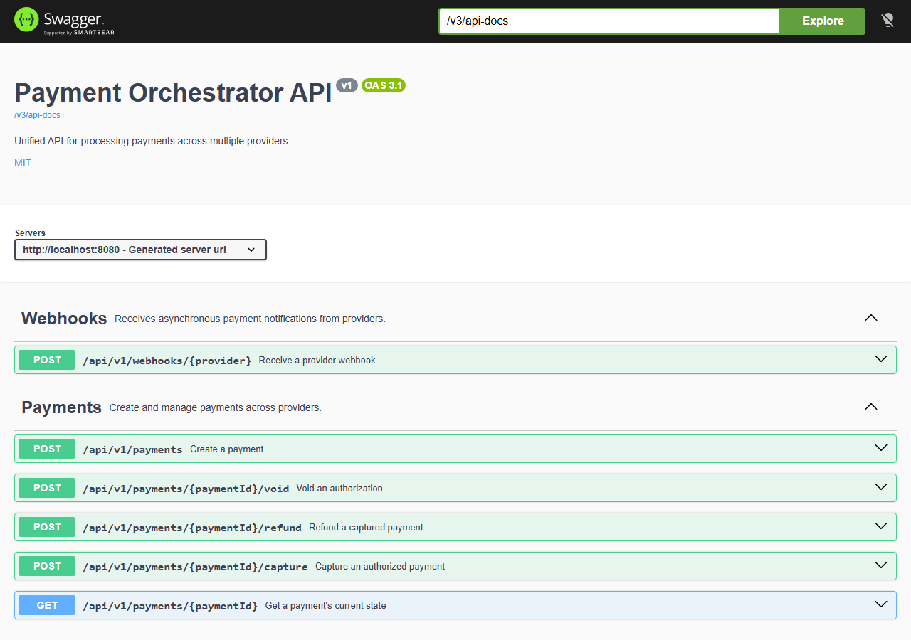

# Payment Orchestrator

> A payment orchestration platform built with Java and Spring Boot, demonstrating clean provider abstraction behind a unified API for integrating multiple payment providers.

Payment Orchestrator abstracts provider-specific implementations behind a common interface, enabling applications to process payments through a consistent API without being tightly coupled to any single payment provider.

The project demonstrates enterprise software engineering practices including Clean Architecture, SOLID principles, gateway abstraction, idempotent payment processing, webhook handling, audit logging, and secure payment integrations.

---

## Overview

Modern applications often need to integrate with multiple payment providers for business, regional, cost, or reliability reasons. Each provider exposes different APIs, authentication mechanisms, payment workflows, and webhook formats, resulting in duplicated code and tightly coupled integrations.

Payment Orchestrator solves this problem by introducing a unified orchestration layer that decouples business logic from payment providers. New providers can be added or existing ones replaced with minimal changes to the application.

---

## Who Is This Project For?

This project is intended for:

* Backend developers learning payment integrations
* Software architects designing payment platforms
* Fintech engineers
* Developers building e-commerce and SaaS applications

---

## Architecture

```text
                        Client Application
                                │
                                ▼
                         REST Controller
                                │
                                ▼
                     Payment Orchestrator
                                │
                ┌───────────────┼────────────────┐
                ▼               ▼                ▼
         Stripe Adapter   Adyen Adapter   Checkout Adapter
                │               │                │
                └───────────────┴────────────────┘
                                │
                                ▼
                       Payment Providers
```

The application follows the **Strategy Pattern**, **Adapter Pattern**, and **Dependency Inversion Principle**, allowing payment providers to be added without modifying the business layer.

For how a single authorize request is checkpointed, sent to the gateway, and resolved when the
provider's response never comes back synchronously, see the
[authorization sequence diagram](docs/diagrams/authorize-sequence.md).

---

## Key Highlights

* Unified Payment API
* Multi-provider architecture
* Provider abstraction
* Authorization & Capture
* Purchase (Sale)
* Refunds
* Payment Status
* Webhook Processing
* Idempotent Requests
* Crash-Safe Reconciliation (backend-owned idempotency keys, pending-state checkpoints, bounded-retry backstop job)
* Circuit Breaker Resilience (Resilience4j)
* Audit Logging
* OpenAPI / Swagger Documentation
* Docker Support
* Integration Tests

---

## Supported Payment Providers

| Provider     | Status |
| ------------ | :----: |
| Stripe       |   ✅   |
| Adyen        |   🚧   |
| Checkout.com |   🚧   |

Stripe is fully implemented — authorize, capture, refund, and void, webhook signature verification
with metadata-based correlation, a Resilience4j circuit breaker, and crash-safe reconciliation for
outbound calls whose outcome never comes back synchronously.

Authorization confirms **server-side**: the client tokenizes the card into a Stripe `PaymentMethod`
(so raw card data never reaches this backend), sends that token to `POST /api/v1/payments`, and the
backend creates *and* confirms the `PaymentIntent` with Stripe in one call — there is no client-side
`stripe.confirmPayment()` step and no `client_secret` involved. The tradeoff: cards that come back
`requires_action` (3D Secure / SCA) aren't supported by this flow and are currently reported as a
decline rather than driving a redirect-based challenge. See the
[authorization sequence diagram](docs/diagrams/authorize-sequence.md) for the full picture.

Adyen and Checkout.com are wired and resolvable through the gateway port, but their provider calls
are still stubs. Having all three in place from the start is deliberate — it keeps the port designed
against several providers rather than shaped around whichever one landed first.

The architecture is designed to support additional providers with minimal implementation effort.

---

## Technology Stack

### Backend

* Java 25
* Spring Boot 4
* Spring Web
* Spring Validation
* Spring Data JPA
* Flyway (schema migrations)
* Resilience4j (circuit breaker)
* Stripe Java SDK

### Database

* PostgreSQL

### Documentation

* OpenAPI 3
* Swagger UI

### Build & Deployment

* Maven
* Docker
* Docker Compose

### Testing

* JUnit 5
* Mockito
* Testcontainers
* WireMock (stubbed Stripe HTTP calls)
* ArchUnit (enforced layering)
* JaCoCo (coverage reporting)

---

## REST API

### Create Payment

```http
POST /api/v1/payments
```

### Capture Payment

```http
POST /api/v1/payments/{paymentId}/capture
```

### Refund Payment

```http
POST /api/v1/payments/{paymentId}/refund
```

### Void Payment

```http
POST /api/v1/payments/{paymentId}/void
```

### Get Payment Status

```http
GET /api/v1/payments/{paymentId}
```

---

## Project Structure

The code is organised by **bounded context** first and by technical layer second, so a feature lives
in one place instead of being scattered across `controller/`, `service/`, and `repository/` folders.

```text
com.j4mb.payment_orchestrator
├── common/                          Shared kernel — DomainEvent, AggregateRoot (framework-free)
├── config/                          Composition root — OpenAPI, Clock, domain-service beans
└── payments/                        Bounded context
    ├── domain/                      Tactical DDD — no Spring, no JPA, no HTTP
    │   ├── model/                   Payment (aggregate root), PaymentId
    │   ├── vo/                      Money, PaymentStatus, ProviderType, ProviderReference,
    │   │                            IdempotencyKey, CaptureMode
    │   ├── event/                   PaymentAuthorized / Captured / Refunded / Voided /
    │   │                            AuthorizationPending / RefundPending
    │   ├── service/                 RefundPolicy
    │   └── exception/               Invariant violations
    ├── application/                 Use cases and the ports they talk through
    │   ├── port/in/                 AuthorizePayment, CapturePayment, RefundPayment,
    │   │                            VoidPayment, GetPaymentStatus, ProcessWebhook
    │   ├── port/out/                PaymentGatewayPort, PaymentRepositoryPort,
    │   │                            IdempotencyStorePort, DomainEventPublisherPort
    │   ├── command/                 Input records per use case
    │   ├── dto/                     PaymentResult (read-only projection)
    │   ├── service/                 Use-case implementations, PaymentGatewayResolver,
    │   │                            ReconcilePendingPaymentsService
    │   └── exception/               Application-level failures
    └── infrastructure/              Adapters — depend inward only
        └── adapter/
            ├── in/web/              PaymentController, WebhookController, DTOs, mapper
            ├── in/scheduled/        PendingPaymentReconciliationJob
            └── out/
                ├── persistence/     JPA entities, repositories, PaymentPersistenceAdapter
                │   └── idempotency/ IdempotencyStoreAdapter
                ├── gateway/         stripe/ · adyen/ · checkout/ — one adapter per provider
                └── audit/           Domain-event listener writing the append-only audit log
```

**The dependency rule:** `domain` depends on nothing, `application` depends only on `domain`, and
`infrastructure` depends on both — never the reverse. `ArchitectureTest` fails the build if that is
violated, which is what makes a single Maven module safe here.

**Adding a provider** means adding one enum constant and one `PaymentGatewayPort` implementation.
No domain or application code changes.

---

## Design Principles

* Strategic DDD — bounded contexts as top-level packages
* Tactical DDD — aggregate root, value objects, domain events, domain services
* Hexagonal Architecture (Ports & Adapters)
* Clean Architecture dependency rule, enforced by ArchUnit
* SOLID Principles
* Strategy Pattern (provider selection) & Adapter Pattern (provider integration)
* Dependency Inversion — the application defines ports, infrastructure satisfies them
* RESTful API Design

---

## Security

* HTTPS (deployment-level)
* Secure Secret Management (credentials read from the environment, never committed — see `.env`)
* Idempotency Keys (client-facing and backend-owned, per provider call)
* Webhook Signature Verification
* Input Validation

---

## Roadmap

* [x] Hexagonal / DDD project structure with enforced boundaries
* [x] Stripe Integration
* [ ] 3D Secure / SCA support (client-side confirmation flow)
* [ ] Adyen Integration
* [ ] Checkout.com Integration
* [ ] Payment Dashboard
* [ ] Customer Management
* [ ] Subscription Payments
* [ ] Apple Pay
* [ ] Google Pay
* [ ] Metrics & Monitoring
* [ ] CI/CD Pipeline

---

## Running the Project

```bash
git clone https://github.com/g-j4mb/payment-orchestrator.git

cd payment-orchestrator

docker compose up -d

./mvnw spring-boot:run
```

Swagger UI

```text
http://localhost:8080/swagger-ui.html
```



---

## Future Enhancements

* Kafka Event Streaming
* Distributed Tracing
* Redis Caching
* Event Sourcing
* Multi-tenancy
* PCI DSS Best Practices
* AWS Deployment

---

## License

This project is licensed under the MIT License.
