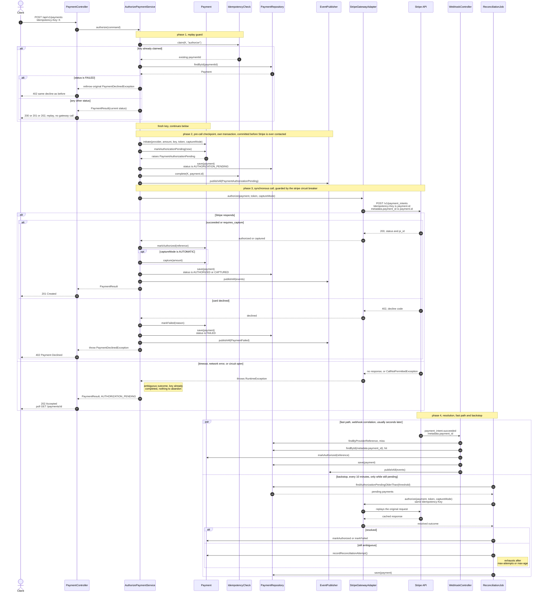

# Authorization Sequence — Checkpoint-First Authorize

Every authorize call is durably recorded as `AUTHORIZATION_PENDING` in its own committed
transaction *before* Stripe is ever contacted — so a crash, timeout, or open circuit breaker
mid-call leaves a resolvable record instead of a lost payment. This traces one request from
`POST /api/v1/payments` through to final resolution, including the two independent paths — a
webhook and a backstop job — that close out a call whose outcome never came back synchronously.

## Why it's shaped this way

**The checkpoint runs pre-call.** `markAuthorizationPending` and `save()` commit in their own
`PROPAGATION_REQUIRES_NEW` transaction before `gateway.authorize()` is invoked. A JVM crash
mid-call still leaves a row reconciliation can act on — a reactive checkpoint written only from a
catch block cannot make that guarantee.

**Webhook is the fast path, the job is the backstop.** `metadata[payment_id]` set on the
PaymentIntent lets `ProcessWebhookService` correlate a payment that never got a
`providerReference` recorded. `ReconcilePendingPaymentsService` exists only for what the webhook
misses — it runs every ten minutes, not ten seconds.

**Reconciliation is bounded, not infinite.** Every pass reuses the same `Idempotency-Key` Stripe
already saw, so a resolved call just replays its cached answer. An unresolved one increments
`reconciliationAttempts` until `max-attempts` or `max-age` trips — then it's marked `FAILED` for a
human to look at.

## Source

- [AuthorizePaymentService.java](../../src/main/java/com/j4mb/payment_orchestrator/payments/application/service/AuthorizePaymentService.java)
- [Payment.java](../../src/main/java/com/j4mb/payment_orchestrator/payments/domain/model/Payment.java)
- [StripePaymentGatewayAdapter.java](../../src/main/java/com/j4mb/payment_orchestrator/payments/infrastructure/adapter/out/gateway/stripe/StripePaymentGatewayAdapter.java)
- [ProcessWebhookService.java](../../src/main/java/com/j4mb/payment_orchestrator/payments/application/service/ProcessWebhookService.java)
- [ReconcilePendingPaymentsService.java](../../src/main/java/com/j4mb/payment_orchestrator/payments/application/service/ReconcilePendingPaymentsService.java)
